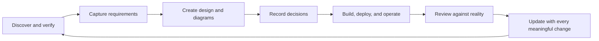

# Project Documentation Starter Kit

**A practical reference and copy-ready template library for documenting software systems, cloud platforms, infrastructure, and architecture decisions.**

This repository helps teams create documentation that is useful after launch—not just at handoff. It brings together a discovery-first workflow, architecture guidance, operational references, and reusable templates so people can understand, change, deploy, troubleshoot, and maintain a system even when its original contributors are unavailable.

> **Core principle:** If a system changes, update the documentation that explains it. Keep the canonical copy discoverable, versioned, evidence-based, and owned.

## What You Can Do With This Kit

- Discover and describe an unfamiliar project without presenting guesses as facts.
- Connect business requirements to high-level and low-level designs, implementation, and tests.
- Choose architecture diagrams for their audience and purpose.
- Specify measurable quality scenarios and maintain a prioritized technical risk register.
- Record why important decisions were made—not only what was selected.
- Document deployment, security, operations, incident learning, troubleshooting, backup, and recovery.
- Establish clear documentation ownership, review cadence, and change history.
- Use AI to draft or review documentation while requiring evidence and explicit unknowns.

## Start in Five Steps

1. **Discover:** Start with [Project Discovery](docs/01-PROJECT-DISCOVERY.md). Verify the repository, configuration, infrastructure, and authoritative sources before documenting conclusions.
2. **Set up the index:** Copy [`templates/project-documentation-index.md`](templates/project-documentation-index.md) to the canonical documentation location. Identify the audience, owners, source of truth, and review cadence.
3. **Choose artifacts:** Use the [Architecture Artifacts guide](docs/19-ARCHITECTURE-ARTIFACTS.md) and [`templates/README.md`](templates/README.md) to select only the documents your project needs.
4. **Document and link:** Capture requirements, design, diagrams, decisions, and operational procedures. Link related artifacts rather than duplicating content.
5. **Review and maintain:** Apply the [Documentation Review checklist](docs/17-DOCUMENTATION-REVIEW.md), then follow the [Documentation Lifecycle guide](docs/18-DOCUMENTATION-LIFECYCLE.md) as the system changes.

## Documentation Workflow



Documentation is a continuing engineering activity. Update relevant artifacts alongside changes to code, infrastructure, interfaces, configuration, security controls, or operating procedures. Record **what changed, when, who changed it, and why**; preserve decision history instead of silently replacing the rationale.

## Repository Map

### Guides and project references

| File | What it covers |
|---|---|
| [`docs/01-PROJECT-DISCOVERY.md`](docs/01-PROJECT-DISCOVERY.md) | Discovery questions, evidence status, and unknown register. |
| [`docs/02-PROJECT-OVERVIEW.md`](docs/02-PROJECT-OVERVIEW.md) | Project purpose, users, capabilities, and scope. |
| [`docs/03-ARCHITECTURE.md`](docs/03-ARCHITECTURE.md) | Architecture overview, key questions, and decision example. |
| [`docs/04-COMPONENTS.md`](docs/04-COMPONENTS.md) | Component responsibilities, dependencies, and failure behavior. |
| [`docs/05-DATA-FLOW.md`](docs/05-DATA-FLOW.md) | Data movement, protocols, and data-flow questions. |
| [`docs/06-NETWORK.md`](docs/06-NETWORK.md) | Connectivity, exposure, and network inventory. |
| [`docs/07-SECURITY.md`](docs/07-SECURITY.md) | Authentication, authorization, secret handling, and security evidence. |
| [`docs/08-API.md`](docs/08-API.md) | API documentation structure and example endpoint format. |
| [`docs/09-DEPLOYMENT.md`](docs/09-DEPLOYMENT.md) | Deployment flow, release checklist, and rollback status. |
| [`docs/10-CONFIGURATION.md`](docs/10-CONFIGURATION.md) | Configuration matrix and secret-management practices. |
| [`docs/11-OPERATIONS.md`](docs/11-OPERATIONS.md) | Daily operations, runbook example, and ownership. |
| [`docs/12-MONITORING.md`](docs/12-MONITORING.md) | Availability, performance, application monitoring, and alerts. |
| [`docs/13-BACKUP-RECOVERY.md`](docs/13-BACKUP-RECOVERY.md) | Backup inventory, recovery questions, and restore validation. |
| [`docs/14-DISASTER-RECOVERY.md`](docs/14-DISASTER-RECOVERY.md) | Recovery models, RTO/RPO, and disaster recovery design. |
| [`docs/15-TROUBLESHOOTING.md`](docs/15-TROUBLESHOOTING.md) | A repeatable troubleshooting method and example. |
| [`docs/16-CHANGELOG.md`](docs/16-CHANGELOG.md) | Human-readable record of meaningful documentation changes. |
| [`docs/17-DOCUMENTATION-REVIEW.md`](docs/17-DOCUMENTATION-REVIEW.md) | Accuracy, operational readiness, ownership, and quality checklist. |
| [`docs/18-DOCUMENTATION-LIFECYCLE.md`](docs/18-DOCUMENTATION-LIFECYCLE.md) | Source of truth, ownership, review cadence, and change workflow. |
| [`docs/19-ARCHITECTURE-ARTIFACTS.md`](docs/19-ARCHITECTURE-ARTIFACTS.md) | BRD, HLD, LLD, ADRs, decision logs, diagrams, and artifact repositories. |
| [`docs/20-INCIDENT-LEARNING.md`](docs/20-INCIDENT-LEARNING.md) | Blameless post-incident learning, evidence, follow-up actions, and review process. |
| [`docs/21-RESEARCH-REFERENCES.md`](docs/21-RESEARCH-REFERENCES.md) | Public repositories and frameworks reviewed, with the practices applied in this kit. |

These files are **reference examples and guidance**, not claims about your project. Verify and adapt them before using them as project documentation.

### Copy-ready templates

The files in [`templates/`](templates/README.md) are reusable starting points. Copy the ones you need into your project's canonical documentation location, replace placeholders, and remove irrelevant sections.

| Template | Use it for |
|---|---|
| [`project-documentation-index.md`](templates/project-documentation-index.md) | A landing page for project artifacts, audiences, owners, status, and review dates. |
| [`business-requirements.md`](templates/business-requirements.md) | Business context, scope, measurable outcomes, functional and non-functional requirements, and traceability. |
| [`high-level-design.md`](templates/high-level-design.md) | System boundaries, major components, integrations, measurable quality scenarios, and key trade-offs. |
| [`low-level-design.md`](templates/low-level-design.md) | Component responsibilities, contracts, data models, interaction flows, errors, and testing. |
| [`architecture-decision-record.md`](templates/architecture-decision-record.md) | Context, options, rationale, consequences, and follow-up for one significant decision. |
| [`architecture-decision-record-lightweight.md`](templates/architecture-decision-record-lightweight.md) | A concise record for a small, low-risk decision. |
| [`decision-log.md`](templates/decision-log.md) | A searchable index of decisions linked to their ADRs or evidence. |
| [`architecture-diagrams.md`](templates/architecture-diagrams.md) | Mermaid starters for context, components, network, data flow, sequence, security, integration, and disaster recovery views. |
| [`risk-register.md`](templates/risk-register.md) | Cross-cutting risk statements, likelihood and impact, mitigation, ownership, and review. |
| [`operational-runbook.md`](templates/operational-runbook.md) | Verified diagnosis, operational procedures, recovery, validation, and escalation. |
| [`postmortem.md`](templates/postmortem.md) | Blameless incident impact, evidence-based timeline, contributing conditions, and owned actions. |

See [`templates/README.md`](templates/README.md) for the suggested order, selection guidance, and publishing checklist.

### Additional resources

| File | What it covers |
|---|---|
| [`AI-PROMPTS.md`](AI-PROMPTS.md) | Prompts for discovery, architecture, gap analysis, documentation review, and runbook drafting. |
| [`CONTRIBUTING.md`](CONTRIBUTING.md) | Principles and pull request checklist for maintaining this kit. |

## Evidence and Accuracy

Classify important claims consistently throughout discovery and documentation:

| Status | Meaning | What to include |
|---|---|---|
| ✅ **Confirmed** | Verified from code, configuration, infrastructure, tests, diagrams, or an authoritative source. | A concise claim and its evidence or source. |
| ⚠️ **Assumption** | A reasonable inference that has not yet been verified. | The assumption, its impact, and how to validate it. |
| ❓ **Unknown** | Information is missing or cannot currently be confirmed. | The question, impact, validation action, and owner when known. |

Never turn an assumption into a fact. Do not claim that a control, backup, failover, deployment step, or operational procedure exists until it has been verified. Never put credentials, tokens, or sensitive production data in documentation.

## Architecture Artifact Relationships

Use the level of detail appropriate to the decision and audience. These artifacts should connect, not repeat one another:

```text
Business requirements (BRD)
              |
              v
Functional and non-functional requirements
              |
              v
High-level design (HLD)
              |
              v
Low-level design (LLD)
              |
              v
Implementation, tests, and operations

Architecture decision records (ADRs) explain important choices across the design.
Diagrams provide focused views for specific audiences and questions.
```

- **BRD:** why the business needs a capability and what outcomes are expected.
- **HLD:** system boundaries, major building blocks, and how they work together.
- **LLD:** implementation details needed to build or change a component.
- **ADR:** why a consequential option was chosen, including alternatives and trade-offs.
- **Decision log:** an index that makes decisions easy to find.
- **Diagram:** a focused visual with a stated purpose, scope, and intended audience.

Complement this topic-based structure with a reader-intent check: is each page a **tutorial**, **how-to guide**, **reference**, or **explanation**? See the [Architecture Artifacts guide](docs/19-ARCHITECTURE-ARTIFACTS.md#organize-for-reader-intent).

## Research-Informed, Tool-Agnostic

This kit was compared with public architecture, ADR, incident-response, and documentation-framework projects. Useful practices were adapted as optional patterns: quality-attribute scenarios, a separate technical risk register, blameless postmortems, lightweight ADRs, and reader-intent classification. Mermaid remains a simple starting point; C4-PlantUML and Structurizr are optional when a team needs richer diagrams-as-code workflows. See [Research References](docs/21-RESEARCH-REFERENCES.md) for the sources and how they informed this kit.

## Using AI Responsibly

Use the prompts in [`AI-PROMPTS.md`](AI-PROMPTS.md) to accelerate discovery, drafting, and review—not to replace verification or ownership. Require the AI to:

- Analyze available repository and project evidence before making claims.
- Separate Confirmed, Assumption, and Unknown information.
- Cite a file, configuration, command, or authoritative source for findings.
- List validation actions for unresolved questions.
- Avoid inventing endpoints, deployment steps, security controls, or operational commands.
- Keep incident postmortems blameless and separate confirmed evidence from hypotheses.

Review generated content against the actual system before publishing it.

## Contributing

When changing a system or this documentation kit:

- Update affected documentation and diagrams with the related change.
- Preserve decision history and link related requirements, designs, and implementation.
- Mark unverified claims and assign validation actions.
- Keep examples clearly distinguishable from verified project facts.
- Check links and examples, and ensure no secrets or sensitive data are included.

See [`CONTRIBUTING.md`](CONTRIBUTING.md) for the full contribution checklist.
