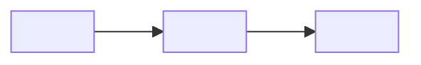
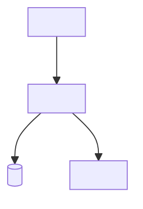
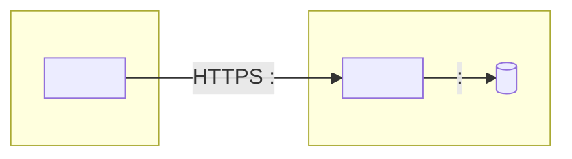
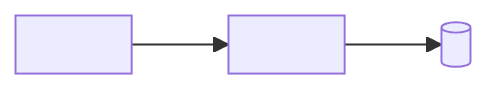
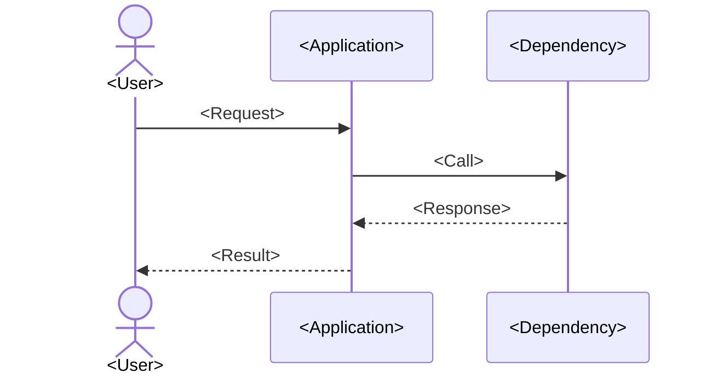
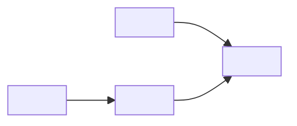

# Architecture Diagram Pack

> Copy only the views your readers need. These Mermaid fragments are illustrative scaffolding, not assertions about your system. Replace every placeholder with verified information and link the diagram to its HLD or LLD.

## Diagram Metadata

| Field | Value |
|---|---|
| Title / view | `<system context, network, data flow, etc.>` |
| Purpose | `<question this diagram answers>` |
| Audience | `<business, engineering, security, data, operations>` |
| Scope / exclusions | `<what is and is not shown>` |
| Owner / last reviewed | `<team / YYYY-MM-DD>` |
| Source / related design | `<link>` |

## System Context / HLD

## Component / LLD

## Network and Trust Boundaries

## Data Flow

Add data classification, transformations, retention, or replication notes where relevant and verified.

## Sequence

Add alternate, timeout, and failure paths that materially affect the scenario.

## Integration / Communication

Document interface ownership, direction, protocol, and synchronous or asynchronous behavior.

## Security View

Show verified identities, trust boundaries, and controls without exposing secrets or sensitive implementation details.

## Disaster Recovery

Link recovery targets and tested procedures; do not imply replication or failover exists unless verified.
