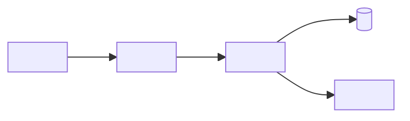

# High-Level Design — `<system or change>`

> Explain boundaries and major design choices for the intended audience. Keep implementation detail in the LLD. Replace illustrative placeholders with verified facts.

## Document Control

| Field | Value |
|---|---|
| Status | `<Draft / In review / Approved / Superseded>` |
| Owner | `<name or team>` |
| Last updated / reviewed | `<YYYY-MM-DD>` |
| Audience | `<business, architecture, security, delivery, operations>` |
| Requirements | `<links or IDs>` |
| Related ADRs | `<IDs and links>` |

## Summary

`<Describe the proposed or current system and its business purpose in a few sentences.>`

## Context and Scope

### Problem and goals

`<What need does this design address? Link to approved requirements.>`

### Scope

- In scope: `<boundaries>`
- Out of scope: `<explicit exclusions>`

### Constraints and assumptions

| Item | Status | Evidence or validation |
|---|---|---|
| `<constraint or assumption>` | `<Confirmed / Assumption / Unknown>` | `<source or action>` |

## System Context

`<Describe the actors and external systems. Replace this illustrative diagram with verified information.>`

## Architecture Overview

### Components

| Component | Responsibility | Technology / hosting | Owner | Evidence |
|---|---|---|---|---|
| `<name>` | `<responsibility>` | `<verified technology or Unknown>` | `<team>` | `<path or source>` |

### Key interactions

`<Summarize request, event, batch, or other key flows. Link to detailed data-flow or sequence diagrams.>`

## Requirements and Quality Attributes

| Requirement ID | Attribute | Target / constraint | Design response | Verification |
|---|---|---|---|---|
| `<REQ-ID>` | `<performance, availability, security, etc.>` | `<target or Unknown>` | `<design response>` | `<test or evidence>` |

### Quality attribute scenarios

For each architecturally significant requirement, define the stimulus, context, observable response, and measurable success threshold. Link the scenario to its originating requirement and verification evidence.

| Scenario ID | Quality attribute | Stimulus / source | Environment | Expected response | Measure / threshold | Requirement / verification |
|---|---|---|---|---|---|---|
| `<QA-001>` | `<availability, latency, security, modifiability, etc.>` | `<event and actor>` | `<load, failure, or operating conditions>` | `<observable system behavior>` | `<target or Unknown>` | `<REQ-ID / test / evidence>` |

If the threshold is not agreed or verified, record it as Unknown and assign an owner to resolve it; do not invent targets.

## Data and Integrations

| Data / integration | Source → destination | Protocol / format | Sensitivity / classification | Evidence |
|---|---|---|---|---|
| `<name>` | `<source → destination>` | `<verified value>` | `<classification or Unknown>` | `<link>` |

## Deployment and Environment View

`<Link the deployment topology and environment differences. Include network boundaries when relevant; use a focused diagram from the architecture diagram template.>`

## Security and Privacy

| Concern | Design / control | Status | Evidence / open action |
|---|---|---|---|
| Identity and access | `<control or Unknown>` | `<Confirmed / Assumption / Unknown>` | `<source or owner>` |
| Data protection | `<control or Unknown>` | `<status>` | `<source or owner>` |
| Trust boundaries | `<boundary or Unknown>` | `<status>` | `<source or owner>` |

Never include secrets, tokens, or sensitive production data.

## Operations and Resilience

| Concern | Approach | Status | Related runbook / evidence |
|---|---|---|---|
| Monitoring and alerting | `<approach or Unknown>` | `<status>` | `<link>` |
| Backup and restore | `<approach or Unknown>` | `<status>` | `<link>` |
| Failure handling / recovery | `<approach or Unknown>` | `<status>` | `<link>` |

## Key Decisions and Trade-offs

| Decision | Rationale | Trade-off | ADR |
|---|---|---|---|
| `<decision>` | `<why>` | `<cost or downside>` | `<ID / link>` |

## Risks and Open Questions

| ID | Risk / question | Impact | Validation action | Owner |
|---|---|---|---|---|
| `<ID>` | `<item>` | `<impact>` | `<action>` | `<owner>` |

## References

- Requirements: `<link>`
- Detailed design: `<link>`
- Diagrams: `<link>`
- ADRs: `<link>`
- Operations and deployment: `<link>`
