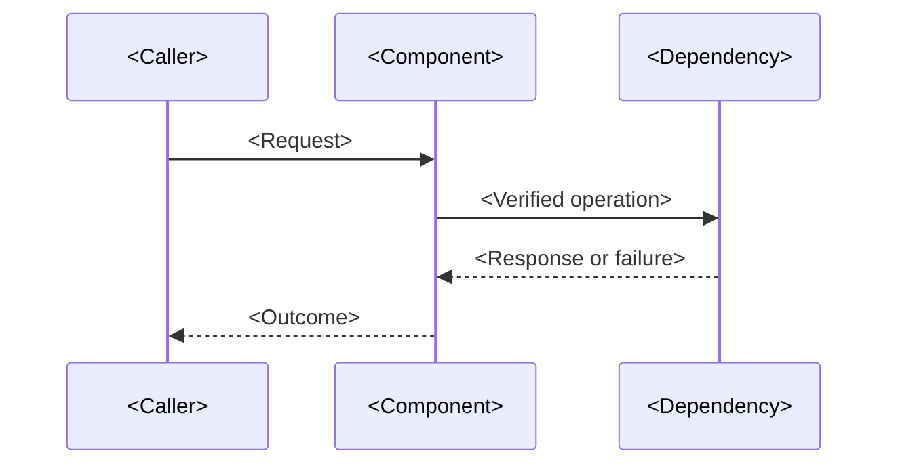

# Low-Level Design — `<component or capability>`

> Document enough verified detail for engineers to implement, review, test, or change this component. Link to the HLD and requirements; do not duplicate their full content.

## Document Control

| Field | Value |
|---|---|
| Status | `<Draft / In review / Approved / Superseded>` |
| Owner | `<name or team>` |
| Last updated / reviewed | `<YYYY-MM-DD>` |
| HLD | `<link>` |
| Requirements | `<IDs / links>` |
| Related ADRs | `<IDs / links>` |

## Component Summary

| Field | Value |
|---|---|
| Name | `<component>` |
| Responsibility | `<one-sentence purpose>` |
| Repository / path | `<verified path>` |
| Runtime / hosting | `<verified value or Unknown>` |
| Owner | `<team>` |

## Detailed Design

### Modules and responsibilities

| Module / class / function | Responsibility | Inputs / outputs | Source path |
|---|---|---|---|
| `<name>` | `<purpose>` | `<contract>` | `<path>` |

### Interfaces and contracts

| Interface | Caller / provider | Protocol / version | Contract / schema |
|---|---|---|---|
| `<API, event, job, or internal interface>` | `<caller → provider>` | `<verified value>` | `<link or schema>` |

### Data model and persistence

| Entity / field | Type / format | Required? | Validation / constraints | Classification |
|---|---|---|---|---|
| `<name>` | `<type>` | `<yes/no>` | `<rule>` | `<classification or Unknown>` |

### Interaction flow

`<Replace the illustrative sequence with the verified flow; include relevant alternate and failure paths.>`

## Validation and Error Behavior

| Condition | Detection / validation | Response | Retry / recovery | User or caller impact |
|---|---|---|---|---|
| `<condition>` | `<method>` | `<verified behavior>` | `<policy or Unknown>` | `<impact>` |

## Configuration and Dependencies

| Setting / dependency | Purpose | Source | Secret? | Failure behavior |
|---|---|---|---|---|
| `<name>` | `<purpose>` | `<configuration source>` | `<yes/no>` | `<behavior or Unknown>` |

Never place secret values in this document.

## Security Considerations

- Authentication and authorization: `<verified behavior or Unknown>`
- Input validation and abuse protection: `<verified behavior or Unknown>`
- Sensitive data handling: `<verified behavior or Unknown>`
- Relevant evidence or security review: `<links>`

## Testing and Deployment

| Test / validation | Requirement covered | How to run / evidence | Status |
|---|---|---|---|
| `<test>` | `<REQ-ID>` | `<command, pipeline, or link>` | `<status>` |

Deployment, migration, and rollback procedure: `<link to verified procedure or Unknown with validation owner>`.

## Open Questions

| Question | Impact | Validation action | Owner |
|---|---|---|---|
| `<question>` | `<impact>` | `<action>` | `<owner>` |
